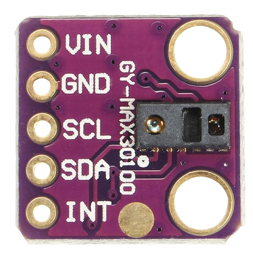
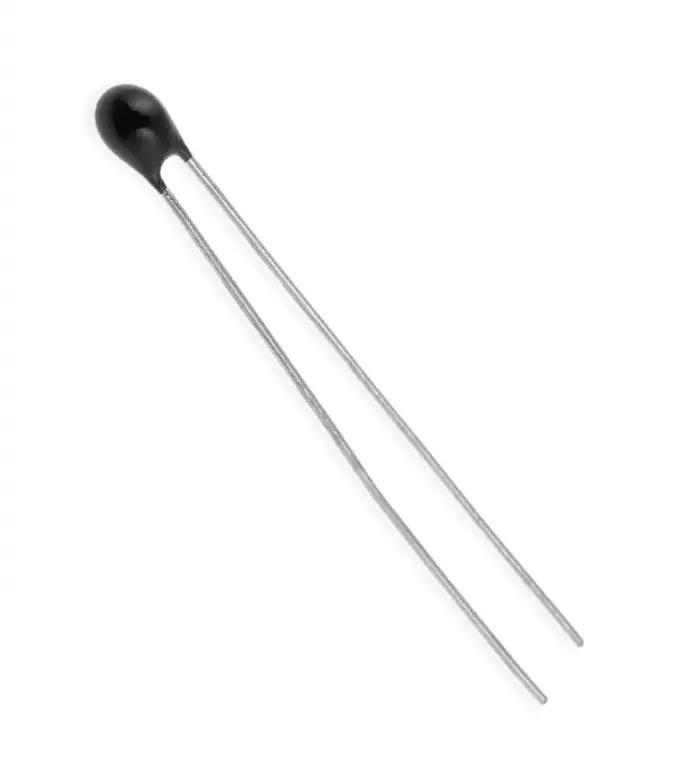
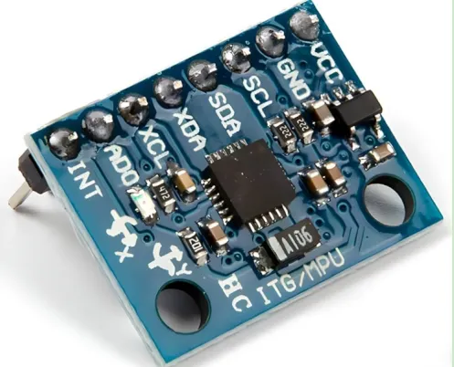
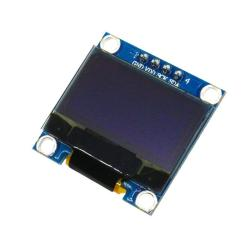

<h1> Sensors data reading using esp8266</h1>
"capteurs_esp8266.ino" is responsible for reading data from sensors and then send that data to the esp32-cam using uart. 
Sensors are: 
max30100 (for heart beat and o2 level) using i2c / thermistor using adc / accelerometer gyroscope using i2c / oled lcd using i2c

  
  
  
  
  

<h1> Sensors data capture and transfer using an esp32-cam</h1>
"ble_esp32.ino" is responsible for receiving the data from the esp8266 using uart then initialing a ble server, service and characteristic. Then using a unique uuid for the service and the characteristic, advertise the data periodically as soon as it connects.

  
  

<h1> Prediction model training and generation </h1>
"health.ipynb", we dicovered, prepared and used the data from "newborn_health_monitoring_with_risk.csv" found in Kaggle (https://www.kaggle.com/datasets/miadul/newborn-health-monitoring-dataset) to train a model. 
We generated this model into "my_health_classifier.joblib" file to be able to use the trained model and include it to the binary of the app we're building. 
We used "conv.py" to convert it to "health_classifier.onnx" so that we can include it to the app using an onnx runtime that we built for android found in : https://github.com/oussamaelwefi/onnx_runtime_for_android
We tested it using "test_onnx.py"  
We used a sickit-learn model in our case. 

  
  
  
  
  

